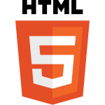

# DE PATRIA A PATRIA (proyecto 6)

## Tripleten web_project_homeland

El proyecto "De Patria a Patria" es un proyecto comenzado en el sprint 5 y terminado en el sprint 6 del programa de Desarrollo web de TripleTen. Realizado a partir de un diseño ejemplo en Figma y desplegado en Github Pages

### Caracteristicas del proyecto

Fue realizado utilizando:

- HTML 5
- CSS
- Flex
- Grid
- Diseño responsivo
- Metodologia BEM
- Media queries

### Link de la página desplegada

https://isuris727.github.io/web_project_homeland/
